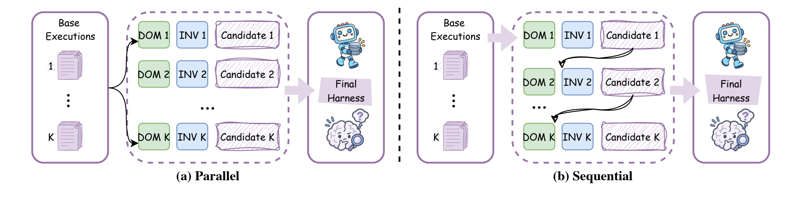

<h3 align="center">
  <br>
  Recursive Agent Harnessing for an Open World
</h3>

<p align="center">
  <a href="https://arxiv.org/abs/TODO"></a>
  <a href="https://harness2.github.io"></a>
  <a href="docs/BENCHMARKS.md"></a>
  <a href="LICENSE"></a>
</p>

<p align="center">
  <a href="docs/BENCHMARKS.md#jobbench">
    
  </a>
</p>

A **harness** is the system around a model that enables it to act as an agent:
prompts, tools, memory, skills, orchestration, and more. **Harnessing** is the
process of optimizing that system.

Harness² is a plug-and-play framework for **recursive agent harnessing** in an
open world, where agents encounter tasks unseen during harness design. It
connects two levels of recursion while keeping model weights fixed:

* **Task-level recursion** refines the execution harness for the current task
  through a contrastive **Propose–Probe–Compose** step: propose edits, probe
  their effects on the same task, and compose a refined harness from behavioral
  contrasts between executions, without ground-truth feedback.
* **Harnessing-level recursion** updates a persistent *improvement harness*
  with adopted harnesses and evidence-supported lessons from each task to guide
  future refinement.

<p align="center">
  <a href="assets/harness2_pipeline.png">
    
  </a>
</p>

Across three professional benchmarks and four model–harness configurations, a
single Harness² step improves GLM-5 and Gemini 3.5 Flash over their base
harnesses, with gains of up to 11.5 points on WorkBuddy-Bench, 4.5 points on
JobBench, and 11.8 percentage points on LAB's partial pass rate. Increasing the
task-level recursion budget brings further gains.

The release supports **parallel and sequential recursion**, **OpenCode and
Codex executors**, and **JobBench, LAB, and WorkBuddy-Bench**.

## Video overview

https://github.com/user-attachments/assets/76b10548-b14b-4c8f-9aa5-a93662df4d56

## Contents

- [Video overview](#video-overview)
- [Harness components](#harness-components)
- [Install](#install)
- [Run a benchmark](#run-a-benchmark)
- [Experiments](#experiments)
- [Web access](#web-access)
- [Results and resume](#results-and-resume)
- [Citation](#citation)
- [Contributing](#contributing)
- [License](#license)
- [Disclaimer](#disclaimer)

## Harness components

Harness² exposes eight editable components around the model: **system prompt,
guardrails, memory, tool guidance, subagents, skills, scripts, and plugins**.
They control context construction, the tool interface, delegation, and behavior
inside the tool loop.

<p align="center">
  <a href="assets/components.png">
    
  </a>
</p>

## Install

Use **Linux, Python 3.12, and [uv](https://docs.astral.sh/uv/getting-started/installation/)**.
From the repository root:

```bash
uv venv --python 3.12 .venv
source .venv/bin/activate
uv pip install -e '.[render]'
harness2-demo --output runs/demo --k 2
```

The local demo runs both recursion modes with deterministic editors and real
Python executions. It requires no model credentials.

For model-backed benchmarks, install **Node.js 20+, the Google Cloud CLI**, and
the [benchmark dependencies](docs/SETUP.md#requirements). LAB needs Pandoc and
Poppler; WorkBuddy-Bench needs Docker. Then configure your models:

```bash
cp .env.example .env
# Edit .env with your Vertex AI project and model IDs.
gcloud auth application-default login
```

See the [setup guide](docs/SETUP.md) for model settings, authentication
alternatives, and the [Codex executor](docs/SETUP.md#codex-executor).

## Run a benchmark

The following example installs LAB and runs one task, then evaluates and reports
its result. Model-backed runs incur API costs; start with a small task selection.

```bash
harness2-setup lab
harness2-check --bench lab
harness2 --bench lab --k 1 --mode parallel \
  --only-domains antitrust-competition --max-tasks 1
harness2-judge --bench lab --k 1 --mode parallel
harness2-report --bench lab --k 1 --mode parallel
```

Sequential recursion runs the same commands with `--mode sequential`. `--k` is
the task-level recursion budget; see [Experiments](#experiments). Judging and
reporting must use the same benchmark, executor, subset, `--k`, `--mode`, and
seed as the refinement run. Add `--dry-run` to `harness2` to preview task
selection without model calls.

| Benchmark | Tasks | Install | Guide |
|---|---|---|---|
| JobBench | Professional work | `harness2-setup jb` | [JobBench](docs/BENCHMARKS.md#jobbench) |
| LAB | Legal work | `harness2-setup lab` | [LAB](docs/BENCHMARKS.md#lab) |
| WorkBuddy-Bench | Office, web, and code | `harness2-setup wb` | [WorkBuddy](docs/BENCHMARKS.md#workbuddy-bench) |

Choose one benchmark per command. WorkBuddy also takes `--subset office`,
`--subset web`, or `--subset code` on every command after setup. The
[benchmark guides](docs/BENCHMARKS.md) cover each one's data, domains, and
grading.

## Experiments

Scale task-level recursion in two ways: **parallel recursion** explores multiple
candidate harnesses and composes refinements from their execution evidence;
**sequential recursion** carries the refined harness and accumulated evidence
through successive Propose–Probe–Compose steps.

<p align="center">
  <a href="assets/harness2_recursion_modes.png">
    
  </a>
</p>
<p align="center"><em>Parallel recursion explores wider; sequential recursion refines deeper.</em></p>

| Option | Behavior |
|---|---|
| `--k 1` | One Propose–Probe–Compose step |
| `--k K --mode parallel` | Probe `K` general and `K` domain-specific candidates, then produce `K` compositions |
| `--k K --mode sequential` | Refine the harness through `K` successive steps |
| `--substrate cx` | Use Codex instead of the default OpenCode executor |

After each task, harnessing-level recursion retains the adopted harness and
evidence-supported lessons to guide future refinement. See the
[experiment guide](docs/EXPERIMENTS.md) for task selection, concurrency,
reproducibility, and baseline comparisons.

## Web access

Executor network access is unrestricted, and Codex runs with its sandbox
disabled. Public benchmark rubrics may be accessible online. Before evaluation,
configure [network restrictions](docs/EXPERIMENTS.md#web-access) to prevent
access to benchmark answers and grading criteria.

## Results and resume

Results are saved under `runs/`, organized by benchmark and subset where
applicable. They include task summaries, deliverables, adopted harnesses,
reflection notes, and evaluation results.

Repeat the same command to resume. Use a new `HARNESS2_RUNS_DIR` when changing
models or task selection. See [results and resume](docs/EXPERIMENTS.md#results-and-resume)
for details; each command also supports `--help`.

## Citation

```bibtex
@article{xu2026harness2,
  title   = {Harness$^2$: Recursive Agent Harnessing for an Open World},
  author  = {Xu, Ruiyao and Chen, Yanfei and CuiZhu, Zhongying and Dalvi Mishra, Bhavana and Ming, Yifei and Yu, Han and Han, Rujun and Lee, Chen-Yu and Pfister, Tomas},
  journal = {arXiv preprint},
  year    = {2026}
}
```

## Contributing

See [CONTRIBUTING.md](CONTRIBUTING.md).

## License

Harness² is licensed under [Apache 2.0](LICENSE). Third-party code under
[`third_party/`](third_party/README.md), benchmarks, and datasets retain their
upstream licenses; see
[third-party notices](dependencies/README.md).

## Disclaimer

This is not an officially supported Google product. This project is not eligible
for the [Google Open Source Software Vulnerability Rewards Program](https://bughunters.google.com/open-source-security).
