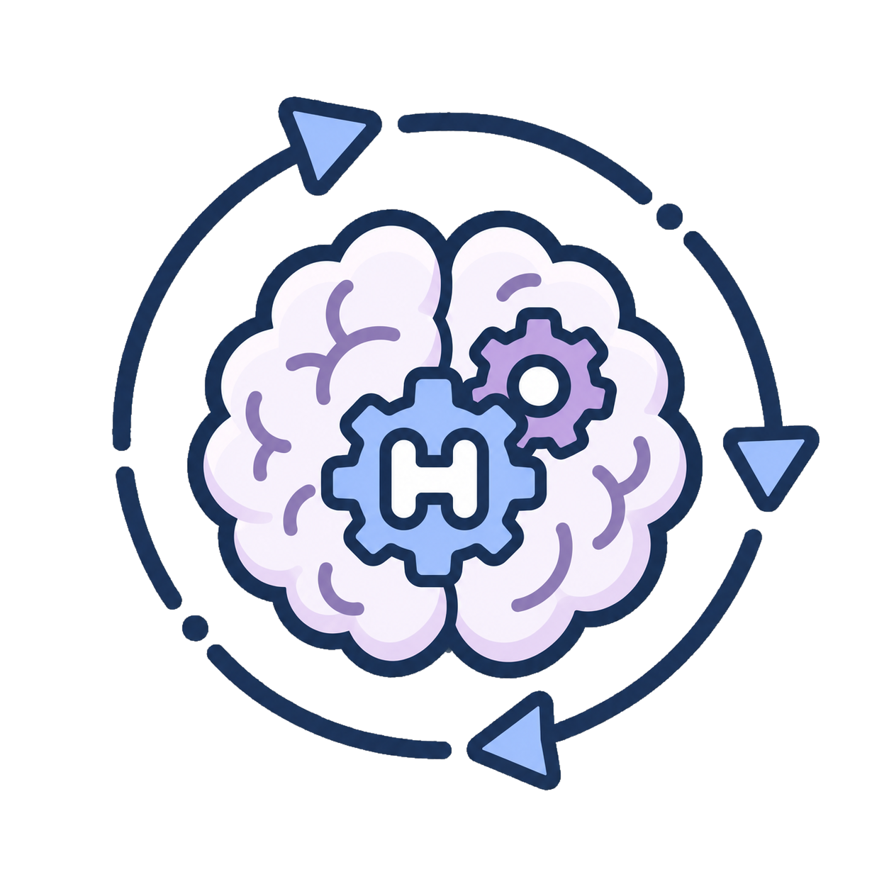
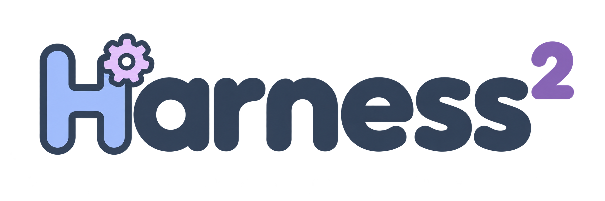
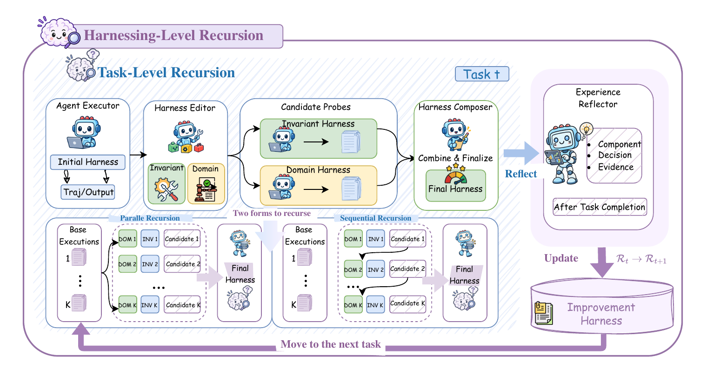
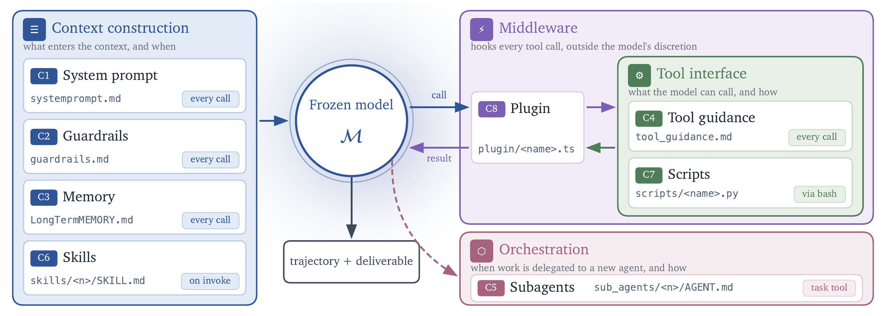

<p align="center">
  <br>
  
</p>
<p align="center"><strong>Recursive Agent Harnessing for an Open World</strong></p>
<p align="center">
  <a href="#install">Install</a> ·
  <a href="#run-a-benchmark">Run a benchmark</a> ·
  <a href="docs/BENCHMARKS.md">Benchmark guides</a> ·
  <a href="#experiments">Experiments</a> ·
  <a href="#web-access">Web access</a>
</p>

Official code for **Harness²: Recursive Agent Harnessing for an Open World**.

Harness² keeps model weights fixed and improves two harnesses. **Task-level
recursion** refines the execution harness through **Propose–Probe–Compose**:
edit general procedures and domain knowledge, execute the candidates, and
compose a successor from their behavioral contrasts. **Harnessing-level
recursion** updates the improvement harness after each task, retaining adopted
harness files and supported lessons in a per-domain library.

<p align="center">
  <a href="assets/harness2_pipeline.png">
    
  </a>
</p>
<p align="center"><em>Improve the executor on the current task; learn how to improve across tasks.</em></p>

The pipeline supports **parallel and sequential recursion**, **OpenCode and
Codex executors**, and **JobBench, LAB, and WorkBuddy-Bench**. Improvement uses
task instructions, trajectories, and deliverables. Reference answers and grader
scores stay out of improvement and selection. The judging command reports the
adopted output; WorkBuddy also runs its verifier inside each execution.

## Harness components

Harness² exposes eight editable components around the model: **system prompt,
guardrails, memory, tool guidance, subagents, skills, scripts, and plugins**.
They control context construction, the tool interface, delegation, and behavior
inside the tool loop.

<p align="center">
  <a href="assets/components.png">
    
  </a>
</p>
<p align="center"><em>The eight harness components and where they act during execution.</em></p>

## Install

Use **Linux and Python 3.12**; the Python package also supports 3.13. On
Debian/Ubuntu:

```bash
sudo apt-get update
sudo apt-get install -y git curl unzip ca-certificates pandoc poppler-utils
```

Pandoc and Poppler are needed by LAB. Also install
[Node.js](https://nodejs.org/en/download) 20 or newer,
[uv](https://docs.astral.sh/uv/getting-started/installation/), and the
[Google Cloud CLI](https://cloud.google.com/sdk/docs/install). WorkBuddy needs
[Docker Engine](https://docs.docker.com/engine/install/) and an account that can
run `docker info`. Benchmark setup installs its own pinned Bun runtime under
`dependencies/`.

Run every command from the `harness2` directory:

```bash
uv venv --python 3.12 .venv
source .venv/bin/activate
uv pip install -e '.[render]'
harness2-demo --output runs/demo --k 2
cp .env.example .env
```

The demo runs both recursion modes across two local tasks with deterministic
editors and real Python executions, and needs no model credentials. Repeat it to
verify resume.

A wheel ships the `harness2` package only, so the task partitioner, invoked as
`python scripts/split_tasks.py`, needs this source tree. For a wheel installation, work from a dedicated directory:
`.env`, `dependencies/`, and `runs/` are resolved there.

### Models and credentials

Edit `.env` with your Vertex AI project and the model IDs available to your
account, then authenticate:

```bash
gcloud auth application-default login
```

A machine with an attached service account needs no further step. Without a
browser, use `gcloud auth application-default login --no-browser`, which prints a
command to run on a machine that has one; or `GOOGLE_APPLICATION_CREDENTIALS`
pointing at a service account key file; or
`gcloud auth application-default login --impersonate-service-account=<account>`.
`gcloud` must be on `PATH` in every case, including the key-file route, because
the installation check runs `gcloud auth application-default print-access-token`.

The shell takes precedence over `.env`. `GOOGLE_CLOUD_PROJECT` identifies your
project; `GOOGLE_CLOUD_LOCATION` defaults to `global`. Account access to each
configured model is required.

| Setting | Meaning |
|---|---|
| `HARNESS2_SOLVER_MODEL` | Executor model in OpenCode's `provider/model` format |
| `HARNESS2_IMPROVER_MODEL` | Improver model in the same format; defaults to the executor |
| `HARNESS2_JUDGE_MODEL` | Bare judge model ID; the adapter supplies the Vertex prefix |
| `HARNESS2_RUNS_DIR` | Output root; defaults to `runs/` |

The provided configuration uses Vertex Gemini executors and judges, and supports
either Vertex Claude or Gemini as the improver. LAB also supports the upstream
judge's direct providers when their credentials are configured. For WorkBuddy,
setup generates the Gemini solver and judge routes from these settings; rerun it
after changing either model.

### Network access

Installation reaches these hosts:

| Host | Used for |
|---|---|
| `github.com` | the pinned upstream checkouts |
| `registry.npmjs.org` | the pinned Bun runtime and Codex CLI, plus what `bun install` resolves |
| `huggingface.co` and its CDN | the JobBench dataset and the WorkBuddy subset archives |
| a Docker registry | the WorkBuddy container image |
| `astral.sh` | the CPython 3.12 build `uv` downloads when the host has no system 3.12 |

`harness2-setup <bench> --dry-run` prints every command that reaches the network,
so an egress-restricted host can be pre-cleared from that output. Experiments
additionally reach the model endpoints configured in `.env`.

## Run a benchmark

Install one benchmark, then run adaptation, judging, and reporting:

```bash
harness2-setup lab
harness2-check --bench lab
harness2 --bench lab --k 1 --mode parallel
harness2-judge --bench lab --k 1 --mode parallel
harness2-report --bench lab --k 1 --mode parallel
```

Sequential recursion runs the same commands with `--mode sequential`. `--k` is
the task-level recursion budget; see [Experiments](#experiments). Judging and
reporting must reuse the adaptation's `--k` and `--mode`.

Each benchmark also has a script that runs the check, adaptation, judging, and
reporting in sequence. Settings are read from `SUBSTRATE`, `K`, `MODE`, and, for
WorkBuddy, `SUBSET`; any further arguments are passed to the adaptation command:

```bash
bash scripts/run_lab.sh --only-domains antitrust-competition --max-tasks 1
SUBSTRATE=cx K=3 MODE=sequential bash scripts/run_jobbench.sh
SUBSET=web bash scripts/run_workbuddy.sh
```

This copy does not include the benchmark runners and patches that setup
installs; see [`harness2/third_party/README.md`](harness2/third_party/README.md).
Everything else, including the demo and the tests, works without them.

Setup clones each upstream checkout at its supported pin under `dependencies/`,
applies the included patches, creates that benchmark's environment, and downloads
the task data. Each benchmark environment lives inside its upstream checkout —
`dependencies/harvey-labs/.venv`, `dependencies/job-bench-eval/.venv`,
`dependencies/workbuddy-bench/.venv` — so the directory follows the upstream
repository name, not the `lab`/`jb`/`wb` command token. Harness² selects their
interpreters automatically; do not activate them for the main commands.

`harness2-setup <bench> --dry-run` previews an installation without changing
anything. `harness2-check` inspects the installation without calling a model;
adaptation runs the same checks, judge configuration included, and refuses to
start when they fail, so running the check first surfaces those problems without
waiting for a sweep to reach them. No model is called until the first real run,
so a model your account cannot serve fails there, not at the check. Adaptation
and judging return nonzero when incomplete.

| Benchmark | Tasks | Install | Guide |
|---|---|---|---|
| JobBench | Professional work | `harness2-setup jb` | [JobBench](docs/BENCHMARKS.md#jobbench) |
| LAB | Legal work | `harness2-setup lab` | [LAB](docs/BENCHMARKS.md#lab) |
| WorkBuddy-Bench | Office, web, and code | `harness2-setup wb` | [WorkBuddy](docs/BENCHMARKS.md#workbuddy-bench) |

Choose one benchmark per command. WorkBuddy also takes `--subset office`,
`--subset web`, or `--subset code` on every command after setup. The
[benchmark guides](docs/BENCHMARKS.md) cover each one's data, domains, and
grading.

### Codex executor

The Codex executor requires an endpoint that implements the OpenAI Responses API.
Vertex AI does not provide this API for Gemini models, so the release includes
`harness2-bridge`, a local LiteLLM server that exposes the Responses API and
forwards requests to Vertex AI using the same Application Default Credentials and
`GOOGLE_CLOUD_PROJECT`. Install the optional dependencies and start the bridge in
a separate session:

```bash
uv pip install -e '.[render,bridge]'
harness2-bridge                 # for WorkBuddy: harness2-bridge --host 0.0.0.0
```

The bridge prints the `HARNESS2_CODEX_*` settings to add to `.env`. Its port and
a generated access key are stored under `dependencies/codex/` and reused when it
restarts, so these settings remain valid. Then pass `--substrate cx` to every
command:

```bash
harness2-setup lab --substrate cx
harness2-check --bench lab --substrate cx
harness2 --bench lab --substrate cx --k 1 --mode parallel
```

WorkBuddy executes Codex inside Docker containers, so the bridge must listen on
`--host 0.0.0.0`; it then also prints `HARNESS2_CODEX_CONTAINER_URL`. Any other
Responses API endpoint can be used instead by setting `HARNESS2_CODEX_BASE_URL`,
`HARNESS2_CODEX_API_KEY`, and `HARNESS2_CODEX_MODEL` directly. Setup records the
endpoint and model in `dependencies/codex/home/config.toml`; rerun it after
changing either, and `harness2-check` reports the file as out of date until then.

## Experiments

Both modes begin with `k` reference executions of the common base harness.
Parallel recursion explores `k` candidate harnesses per scope and composes them;
sequential recursion carries one composed harness through `k` successive steps.
After adoption, reflection stores the adopted harness with a supported lesson in
a per-domain library: tasks in a domain run in order and read only earlier
entries, separate domains can run concurrently, and the library is kept separate
by benchmark, executor, mode, budget, and seed.

| Option | Behavior |
|---|---|
| `--k 1` | One improvement step: edit, probe, compose, and reflect |
| `--k K --mode parallel` | Explore `K` proposals per scope and `K` compositions |
| `--k K --mode sequential` | Carry the harness through `K` successive steps |
| `--workers N` | Run `N` domains concurrently; tasks within a domain stay ordered |
| `--substrate cx` | Use the optional Codex executor; OpenCode is the default |
| `--seed N` | Shuffle the task stream reproducibly; does not control model sampling |

When changing the budget or mode, choose a new output root:

```bash
export HARNESS2_RUNS_DIR=runs/full
harness2 --bench lab --k 3 --mode sequential
harness2-judge --bench lab --k 3 --mode sequential
harness2-report --bench lab --k 3 --mode sequential
```

Run `harness2-judge` and `harness2-report` with the same benchmark, subset, `k`,
mode, and seed used for adaptation. Add `--dry-run` to `harness2` to preview
task selection and available domains without model calls. Adaptation calls paid
models on every rollout and every improver stage — the full LAB stream is 1143
tasks — so check your own pricing before a full run; `--only-domains` and
`--max-tasks` (a per-domain cap) scope a smaller trial.

When comparing budgets or modes, keep task selection, executor, improver, judge,
and web access fixed, and use a distinct `HARNESS2_RUNS_DIR` when changing the
model or task configuration; the saved configuration prevents incompatible
resumes. JobBench's dataset is resolved at download time rather than pinned to a
commit: setup records the Hugging Face revision it received in
`dependencies/job-bench-eval/dataset/main/.harness2-download.json`, so report
that revision alongside any JobBench result.

`harness2-judge --bases` scores a namespace's reference executions, writing
`base_judged.json` beside `judged.json` — the base-harness comparison row.
`harness2-report` covers the adapted harness only.

For a reproducible, domain-stratified partition instead of the installed task set:

```bash
python scripts/split_tasks.py --bench lab --seed 42 --output splits/lab.json
harness2 --bench lab --split-file splits/lab.json --split test --mode parallel
```

The default train fraction is 0.5, generated files are local and not release
assets, and the script refuses to overwrite an existing file.

## Web access

All three benchmarks are public, and JobBench publishes each task's
`RUBRICS.json` on Hugging Face. An executor with network access can therefore
retrieve the criteria used to grade it. In a validation run of this release, a
Codex rollout on JobBench downloaded its task's rubric without being instructed to.
This release does not restrict network access. We recommend blocking the
following hosts for the executor once setup has completed, since setup itself
requires them to download the data:

- `huggingface.co`, `hf.co`, and `*.hf.co`
- `github.com` and `raw.githubusercontent.com`, for the benchmark repositories

Codex runs with its sandbox disabled, so apply the restriction at the network
level, for example with an egress firewall or DNS policy on the executor host,
rather than through a tool setting. Report the restrictions in effect alongside
any result.

## Results and resume

Results are saved under `runs/<benchmark>/` (and the WorkBuddy subset), including
per-task summaries, execution artifacts, adopted harnesses, reflection notes, and
graded results. Repeat the same command to resume. A failed judge stays unscored.
Use a new `HARNESS2_RUNS_DIR` when changing models or task selection.

Adaptation, judging, and reporting use `harness2`, `harness2-judge`, and
`harness2-report`; each has `--help`.

## License

Harness² is licensed under Apache 2.0. Benchmarks, datasets, and
derived runner files retain their upstream licenses; see
[third-party notices](dependencies/README.md).

This is not an officially supported Google product. This project is not eligible for the [Google Open Source Software Vulnerability Rewards Program](https://bughunters.google.com/open-source-security).
